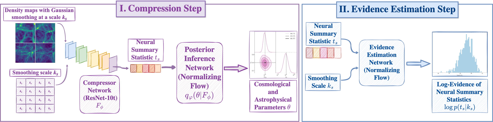

# Detecting Model Misspecification in Cosmology with Scale-Dependent Normalizing Flows

This repository contains the code used for the paper "Detecting Model Misspecification in Cosmology with Scale-Dependent Normalizing Flows" [(arxiv.org/abs/2508.05744)](https://www.arxiv.org/abs/2508.05744).

## Software Dependencies
This code uses `numpy`, `scipy`, `matplotlib`, `pytorch`, `pytorch-lightning`, and `wandb` packages. 
We use `zuko`[^1] to implement normalizing flows in PyTorch and `tarp`[^2] to conduct coverage tests for the posterior estimators.

## Dataset
The total matter and gas density fields are from the Astrid, IllustrisTNG, and SIMBA suites of the CAMELS simulations[^3].

## Code overview
The code is organized as follows: TODO
- The compressor network architecture is defined in the [`utils`](utils/) directory, along with auxiliary utilities (custom dataset classses, `LightningModules`). Our compressor model is based on the ResNet-10-T model from [timm](https://huggingface.co/timm/resnet10t.c3_in1k) repository.
- The [`scripts`](scripts/) directory contains scripts to train compressor network (with and without conditoning on smoothing scale) and evidence estimation network.
- The [`notebooks`](notebooks/) directory contains notebooks used to analyze the results of our experiments and to produce figures from the paper.

## Citation

If you use this code, please cite our paper: TODO

[^1]: <https://github.com/probabilists/zuko>
[^2]: <https://github.com/Ciela-Institute/tarp>
[^3]: <https://camels.readthedocs.io/>

